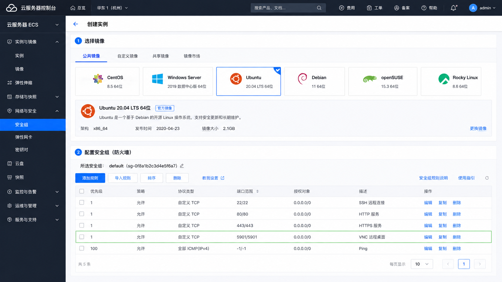

# 01 - 准备阶段

## 你需要准备什么？

| 项目 | 说明 |
|------|------|
| 轻量级云服务器 | 阿里云 / 腾讯云 / 华为云等，建议 2核2G 以上 |
| Ubuntu 20.04 | 在云控制台选择 Ubuntu 20.04 LTS 镜像 |
| 米家账号 | 已绑定智能设备的小米 / 米家账号 |
| VNC Viewer | 本地电脑安装，用于远程连接云服务器桌面 |
| 耐心 | 云服务器部署步骤较多，但按文档一步步来可以完成 |

## 这个项目是什么？

**Home Assistant（简称 HA）** 是一个开源的智能家居控制中心。你可以：

- 把米家、涂鸦、HomeKit 等不同品牌的设备统一管理
- 创建自动化（例如：回家开灯、离家关空调）
- 在网页或手机 App 上查看和控制所有设备

**为什么用云服务器？**

- 24 小时在线，不依赖家里电脑
- 远程访问更方便
- 适合作为智能家居的「中枢大脑」

**整体架构示意：**



**为什么需要 VNC 桌面？**

米家登录有网络验证机制：**登录时浏览器必须和 HA 在同一网络环境**。  
云服务器部署 HA 后，你需要在 VNC 远程桌面里打开浏览器登录米家，才能完成设备接入。

## 整体流程概览

```
云服务器 (Ubuntu)
    │
    ├── 1. 安装桌面 + VNC          → 远程图形界面
    ├── 2. 安装 Docker             → 容器运行环境
    ├── 3. 部署 Home Assistant     → 智能家居中枢
    ├── 4. 安装 HACS               → 社区插件商店
    └── 5. 集成米家设备            → 在 VNC 浏览器中登录
```

## 端口说明

| 端口 | 用途 |
|------|------|
| 5901 | VNC 远程桌面（:1 显示号） |
| 8123 | Home Assistant Web 界面 |
| 22   | SSH 远程命令行（可选） |

## 预计耗时

| 步骤 | 时间 |
|------|------|
| 系统 + VNC 配置 | 30-60 分钟 |
| Docker + HA 部署 | 15-30 分钟 |
| HACS + 米家集成 | 15-30 分钟 |
| **合计** | **约 1-2 小时** |

下一步 → [02-Ubuntu与VNC配置.md](./02-Ubuntu与VNC配置.md)
